# Manual de Usuario - Mi Familia

**Version:** 2.0.0
**Plataforma genealogica de codigo abierto**

**Desarrollo: Eduardo Llaguno Velasco**

**Febrero 2026**


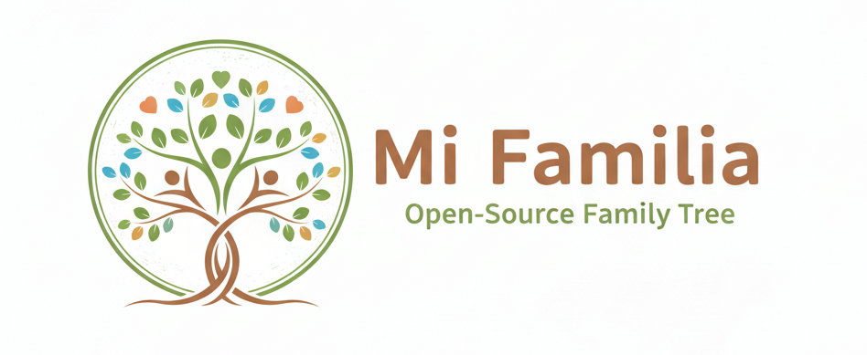

## Tabla de Contenidos

1. [Descripcion General y Arquitectura](#1-descripcion-general-y-arquitectura)
   - [¿Que es Mi Familia?](#que-es-mi-familia)
   - [Caracteristicas principales](#caracteristicas-principales)
   - [Arquitectura técnica](#arquitectura-técnica)
   - [Estructura de datos](#estructura-de-datos)
2. [Guía para Usuarios](#2-guía-para-usuarios)
   - [Primeros pasos](#primeros-pasos)
   - [Tu perfil](#tu-perfil)
   - [Personas](#personas)
   - [Fechas parciales](#fechas-parciales)
   - [Protección de menores](#protección-de-menores)
   - [Familias](#familias)
   - [Árbol genealógico](#árbol-genealógico)
   - [Galería de medios](#galería-de-medios)
   - [Mensajes](#mensajes)
   - [Búsqueda](#búsqueda)
   - [Importar/Exportar GEDCOM](#importarexportar-gedcom)
3. [Manual de Administración](#3-manual-de-administración)
   - [Instalación del sistema](#instalación-del-sistema)
   - [Acceso al panel](#acceso-al-panel-de-administración)
   - [Gestión de usuarios](#gestión-de-usuarios)
   - [Registro de actividad](#registro-de-actividad)
   - [Reportes](#reportes)
   - [Validación y auditoría de datos](#validación-y-auditoría-de-datos)
   - [Configuración del sistema](#configuración-del-sistema)
   - [Mantenimiento](#mantenimiento)

---

# 1. Descripción General y Arquitectura

## ¿Que es Mi Familia?

**Mi Familia** es una plataforma web de codigo abierto disenada para documentar, preservar y compartir la historia genealogica familiar.

La plataforma permite a los usuarios:

- Crear y gestionar árboles genealógicos completos
- Subir fotografías y documentos históricos
- Conectar con otros miembros de la comunidad
- Importar/exportar datos en formato estándar GEDCOM
- Colaborar en la construcción de historias familiares compartidas

## Características Principales

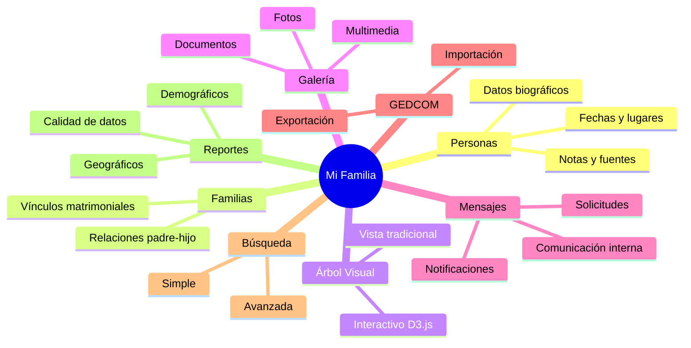

## Arquitectura Técnica

### Stack Tecnológico

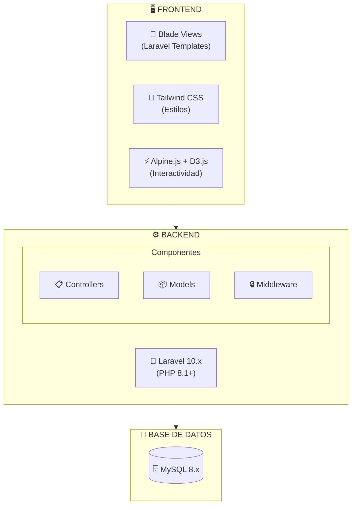

### Componentes Principales

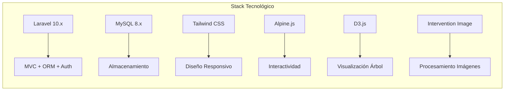

### Estructura de Directorios

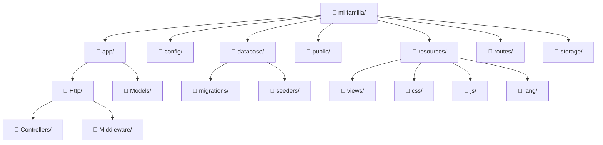

## Estructura de Datos

### Diagrama Entidad-Relación

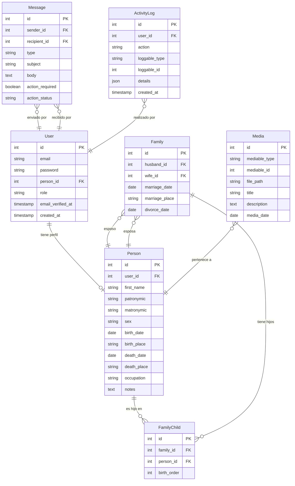

### Modelos Principales

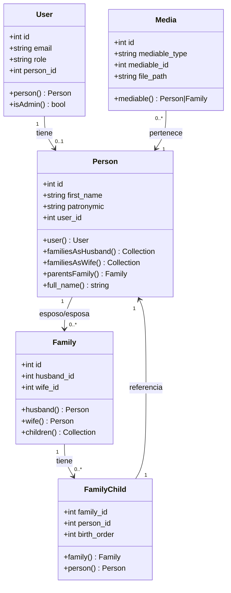

### Flujo de Datos

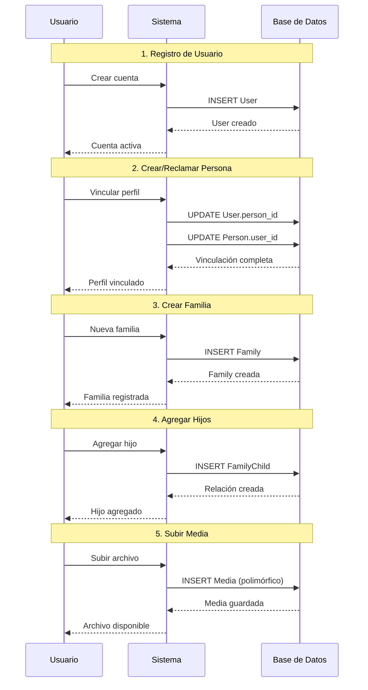

---

# 2. Guía para Usuarios

## Primeros Pasos

### Registro de cuenta

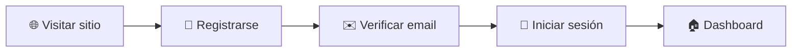

1. Visita la pagina principal de Mi Familia
2. Haz clic en **"Registrarse"**
3. Completa el formulario:
   - **Correo electronico**: Tu direccion de email (sera tu usuario)
   - **Contrasena**: Minimo 8 caracteres con mayusculas, minusculas, numeros y simbolos
   - **Confirmar contrasena**: Repite la contrasena
   - **Datos personales**: Nombre, apellidos, genero, fecha de nacimiento
   - **Herencia familiar**: Indica tu herencia cultural o familiar si aplica
4. Acepta los terminos y condiciones
5. Haz clic en **"Crear cuenta"**
6. Revisa tu correo y haz clic en el enlace de verificacion

> **Nota**: Si no encuentras el correo, revisa tu carpeta de spam.

### Primer ingreso

Después de verificar tu cuenta:

1. Inicia sesión con tu correo y contraseña
2. Verás la pantalla de **Bienvenida** con opciones:
   - **Crear mi perfil**: Si eres nuevo en la genealogía
   - **Buscar mi persona**: Si crees que ya existes en el árbol
   - **Importar GEDCOM**: Si tienes datos de otro programa

### El Dashboard

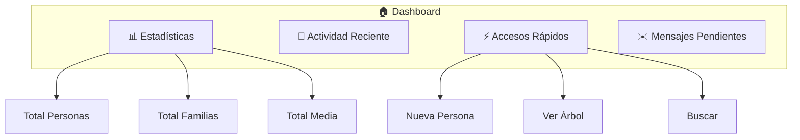

El Dashboard es tu página principal y muestra:

- **Estadísticas**: Total de personas, familias y medios
- **Actividad reciente**: Últimos cambios en el sistema
- **Accesos rápidos**: Enlaces a las funciones más usadas
- **Mensajes pendientes**: Notificaciones sin leer

## Tu Perfil

### Editar perfil de cuenta

Accede desde el menú **Usuario → Editar cuenta**:

- **Correo electrónico**: Tu dirección de contacto
- **Foto de perfil**: Imagen que te representa
- **Idioma preferido**: Espanol o English

### Ver tu perfil personal

Si ya vinculaste tu cuenta con una persona del árbol:

1. Haz clic en **"PERFIL"** en el menú superior
2. Verás tu ficha personal completa con:
   - Datos biográficos
   - Relaciones familiares
   - Línea de tiempo
   - Galería de fotos

### Vincular tu cuenta con una persona existente

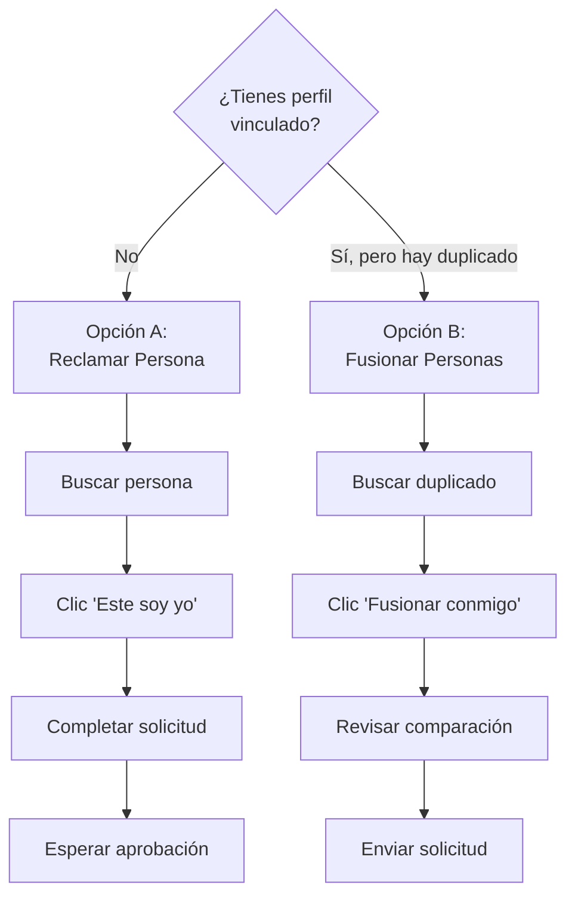

**Opción A - Reclamar persona** (si no tienes perfil):

1. Busca y abre la ficha de la persona
2. Haz clic en el botón verde **"Este soy yo"**
3. Completa el formulario de solicitud
4. El administrador revisará tu solicitud

**Opción B - Fusionar personas** (si ya tienes perfil):

1. Si importaste un GEDCOM y creó un duplicado de ti
2. Busca la persona duplicada
3. Haz clic en **"Fusionar conmigo"**
4. Revisa la comparación de datos
5. Envía la solicitud al administrador

## Personas

### Ver lista de personas

1. En el menú, haz clic en **"Personas"**
2. Verás una tabla con todas las personas registradas
3. Usa los filtros para buscar:
   - Por nombre o apellido
   - Por lugar de origen
   - Por rango de fechas

### Crear una nueva persona

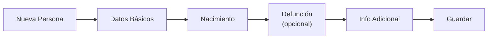

1. Haz clic en **"Nueva Persona"**
2. Completa los campos básicos:

| Campo                | Descripción          | Ejemplo     |
| -------------------- | -------------------- | ----------- |
| **Nombre**           | Nombre(s) de pila    | María Elena |
| **Apellido paterno** | Apellido del padre   | González    |
| **Apellido materno** | Apellido de la madre | Kovačević   |
| **Sexo**             | Masculino/Femenino   | Femenino    |

3. Datos de nacimiento (opcionales):
   
   - Fecha (puede ser aproximada)
   - Lugar
   - Fuente de información

4. Datos de defunción (si aplica):
   
   - Fecha
   - Lugar
   - Causa (opcional)

5. Información adicional:
   
   - Ocupación
   - Notas biográficas
   - Nivel de privacidad

6. Haz clic en **"Guardar"**

### Ver ficha de una persona

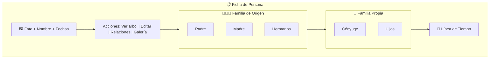

### Editar una persona

1. Abre la ficha de la persona
2. Haz clic en **"Editar"**
3. Modifica los campos necesarios
4. Haz clic en **"Guardar cambios"**

### Agregar foto a una persona

1. Abre la ficha de la persona
2. Haz clic en el ícono de cámara junto a la foto
3. Selecciona una imagen de tu dispositivo
4. La imagen se redimensionará automáticamente
5. Haz clic en **"Subir"**

## Fechas Parciales

### ¿Qué son las fechas parciales?

En genealogia es comun no conocer la fecha exacta de un evento. Mi Familia permite registrar fechas parciales, donde solo se conoce el ano, o el ano y mes, pero no el dia exacto.

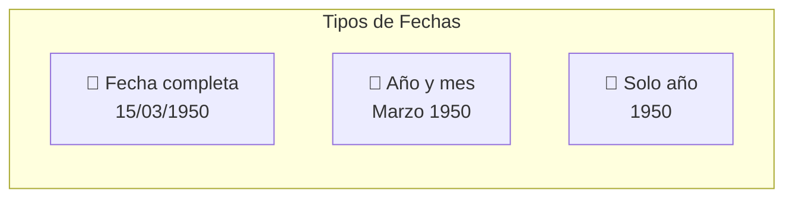

### Cómo ingresar fechas parciales

Al crear o editar una persona, los campos de fecha tienen tres componentes separados:

| Campo | Descripción | Ejemplo |
|-------|-------------|---------|
| **Año** | Año del evento (requerido) | 1950 |
| **Mes** | Mes del evento (opcional) | Marzo |
| **Día** | Día del evento (opcional) | 15 |

1. Ingresa el **año** (obligatorio si conoces algún dato)
2. Si conoces el mes, selecciónalo del desplegable
3. Si conoces el día exacto, ingrésalo

### Cómo se muestran las fechas parciales

Las fechas parciales se muestran de forma clara:

- **Fecha completa**: "15 de marzo de 1950"
- **Sin día**: "Marzo de 1950"
- **Solo año**: "1950"

En el árbol genealógico y las listas, las fechas parciales se distinguen visualmente para indicar que son aproximadas.

## Protección de Menores

### ¿Qué es la protección de menores?

Mi Familia protege automaticamente la informacion sensible de personas menores de edad. Esta proteccion limita que datos pueden ver usuarios que no son familiares directos.

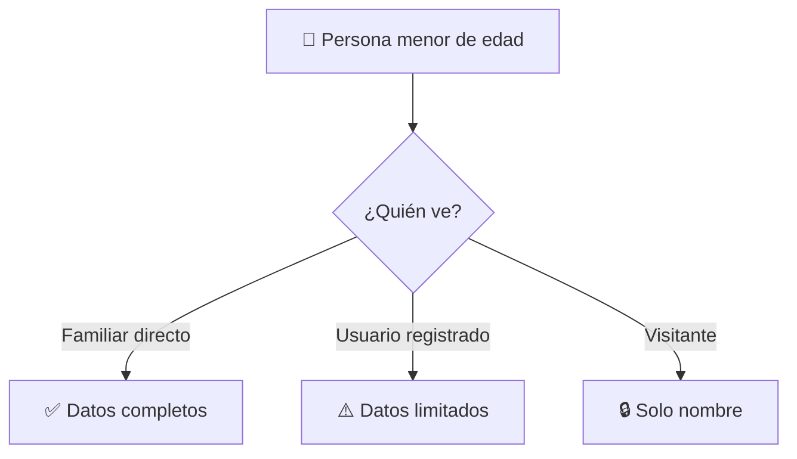

### Datos protegidos

Para personas menores de 18 años, los siguientes datos están protegidos:

| Dato | Visible para familia | Visible para otros |
|------|---------------------|-------------------|
| Nombre completo | Sí | Sí |
| Fecha de nacimiento | Sí | Solo año |
| Lugar de nacimiento | Sí | No |
| Fotografía | Sí | No |
| Biografía | Sí | No |
| Relaciones familiares | Sí | Parcial |

### ¿Quién es considerado "familia"?

Se considera familia directa a:

- Padres y abuelos
- Hermanos
- Tíos y primos
- Personas vinculadas por matrimonio con los anteriores
- El propio usuario si tiene cuenta vinculada

### Configuración

La protección de menores está habilitada por defecto y puede configurarse en:

**Admin → Configuración → Privacidad**

- **Edad de protección**: Por defecto 18 años
- **Nivel de restricción**: Estricto o Moderado

## Familias

### ¿Qué es una familia?

En Mi Familia, una **familia** representa una unidad conyugal:

- Un esposo y/o una esposa
- Sus hijos en común

> **Importante**: Una persona puede pertenecer a múltiples familias (como hijo en una, como padre en otra).

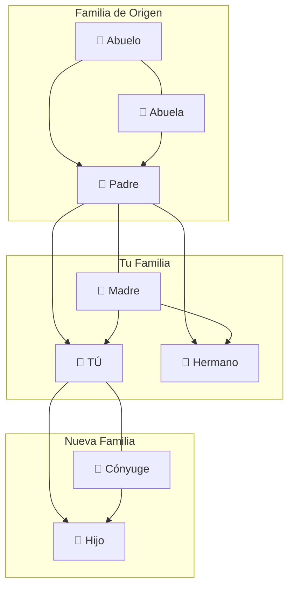

### Crear una familia

1. Ve a **"Familias"** en el menú
2. Haz clic en **"Nueva Familia"**
3. Selecciona:
   - **Esposo**: Busca o crea la persona
   - **Esposa**: Busca o crea la persona
4. Datos del matrimonio (opcionales):
   - Fecha de matrimonio
   - Lugar de matrimonio
   - Fecha de divorcio (si aplica)
5. Haz clic en **"Crear familia"**

### Agregar hijos a una familia

1. Abre la ficha de la familia
2. En la sección **"Hijos"**, haz clic en **"Agregar hijo"**
3. Busca la persona o haz clic en **"Crear nuevo"**
4. Indica el orden de nacimiento (opcional)
5. Haz clic en **"Agregar"**

### Gestionar relaciones desde una persona

También puedes agregar relaciones desde la ficha de persona:

1. Abre la ficha de una persona
2. Haz clic en **"Relaciones"**
3. Selecciona el tipo de relación:
   - **Padre de [nombre]**: Agrega al padre de esta persona
   - **Madre de [nombre]**: Agrega a la madre de esta persona
   - **Cónyuge de [nombre]**: Agrega al cónyuge
   - **Hijo/a de [nombre]**: Agrega un hijo
   - **Hermano/a de [nombre]**: Agrega un hermano
4. Busca la persona en el sistema o créala nueva
5. El sistema creará automáticamente la familia si es necesario

> **Nota**: Las opciones de Padre y Madre están separadas para mayor claridad y para asignar correctamente el género en la relación familiar.

### Agregar a mi árbol

Cuando encuentres una persona que es tu familiar y quieras conectarla a tu árbol:

1. Abre la ficha de la persona
2. Haz clic en el botón rojo **"+ Agregar a mi árbol"**
3. Selecciona la relación que tiene contigo:
   - Mi padre / Mi madre
   - Mi hijo/a
   - Mi hermano/a
   - Mi cónyuge
4. Confirma la relación

El sistema creará automáticamente las conexiones familiares necesarias.

## Árbol Genealógico

### Ver el árbol

1. Haz clic en **"Árbol"** en el menú
2. Selecciona una persona como punto de partida
3. Verás el árbol interactivo

### Controles del árbol

| Acción                  | Cómo hacerlo                  |
| ----------------------- | ----------------------------- |
| **Navegar**             | Arrastra con el mouse         |
| **Zoom**                | Rueda del mouse o botones +/- |
| **Seleccionar persona** | Clic en el nodo               |
| **Ver detalles**        | Doble clic en el nodo         |

### Vista de árbol tradicional

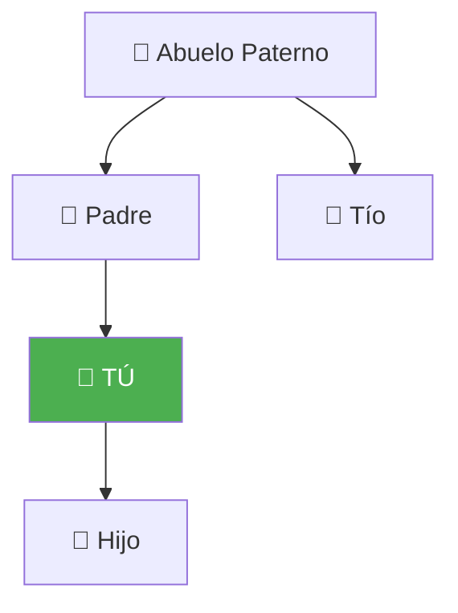

## Galería de Medios

### Tipos de archivos soportados

| Tipo       | Extensiones         | Tamaño máximo |
| ---------- | ------------------- | ------------- |
| Imágenes   | JPG, PNG, GIF, WebP | 10 MB         |
| Documentos | PDF                 | 20 MB         |

### Subir un archivo

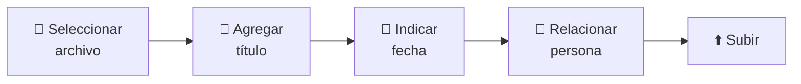

1. Ve a **"Media"** en el menú
2. Haz clic en **"Subir archivo"**
3. Selecciona:
   - **Archivo**: Arrastra o selecciona
   - **Título**: Nombre descriptivo
   - **Descripción**: Detalles del contenido
   - **Fecha**: Cuándo se tomó/creó
   - **Persona relacionada**: A quién pertenece
4. Haz clic en **"Subir"**

### Ver galería de una persona

1. Abre la ficha de una persona
2. Haz clic en **"Galería"**
3. Verás todos los archivos asociados a esa persona

### Establecer foto principal

1. Abre un archivo de la galería
2. Haz clic en **"Establecer como principal"**
3. Esta foto aparecerá en la ficha y el árbol

## Mensajes

### Bandeja de entrada

1. Haz clic en el ícono de sobre en el menú
2. Verás tus mensajes organizados por fecha
3. Los mensajes no leídos aparecen en **negrita**

### Tipos de mensajes

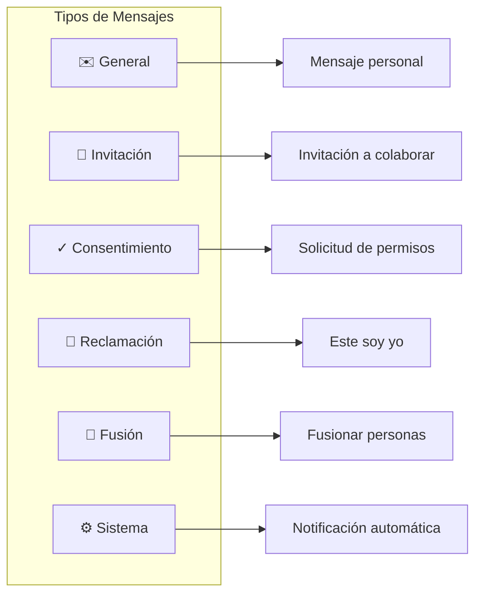

### Enviar un mensaje

1. Haz clic en **"Redactar"**
2. Selecciona el destinatario
3. Escribe el asunto y mensaje
4. (Opcional) Relaciona una persona
5. Haz clic en **"Enviar"**

### Responder solicitudes

Algunos mensajes requieren tu acción:

1. Abre el mensaje
2. Lee los detalles de la solicitud
3. Haz clic en **"Aceptar"** o **"Rechazar"**
4. El solicitante recibirá una notificación

## Búsqueda

### Búsqueda rápida

1. Usa la barra de búsqueda en la parte superior
2. Escribe nombre, apellido o lugar
3. Los resultados aparecen mientras escribes

### Búsqueda avanzada

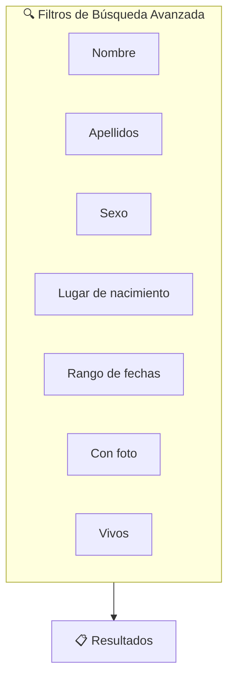

1. Ve a **"Búsqueda"** → **"Avanzada"**
2. Usa los filtros disponibles:

| Filtro              | Descripción                 |
| ------------------- | --------------------------- |
| Nombre              | Nombre(s) de pila           |
| Apellidos           | Paterno y/o materno         |
| Sexo                | Masculino/Femenino          |
| Lugar de nacimiento | Ciudad, estado o país       |
| Rango de fechas     | Nacidos entre año X y año Y |
| Con foto            | Solo personas con foto      |
| Vivos               | Solo personas vivas         |

3. Haz clic en **"Buscar"**

## Importar/Exportar GEDCOM

### ¿Qué es GEDCOM?

GEDCOM (Genealogical Data Communication) es el formato estandar internacional para intercambiar datos genealogicos entre programas. Mi Familia soporta GEDCOM version 5.5.1 con codificacion UTF-8.

### Importar un archivo GEDCOM

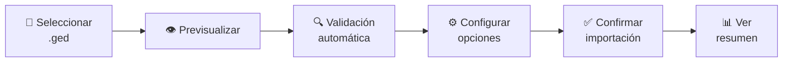

1. Ve a **"GEDCOM"** → **"Importar"**
2. Selecciona tu archivo .ged
3. Haz clic en **"Previsualizar"**
4. El sistema valida automáticamente los datos y detecta:
   - Personas sin nombre
   - Referencias a individuos inexistentes
   - Familias sin padres definidos
   - Ciclos genealógicos (una persona como ancestro de sí misma)
   - Hijos que también son padres en la misma familia
5. Revisa las personas y familias detectadas
6. Configura opciones:
   - **Verificar duplicados**: Buscar personas existentes con mismo nombre y fecha
   - **Actualizar existentes**: Actualizar datos de personas encontradas
   - **Nivel de privacidad**: Público, Familia o Privado
7. Haz clic en **"Confirmar importación"**
8. Espera a que termine el proceso
9. Revisa el resumen con estadísticas:
   - Personas creadas/actualizadas
   - Familias creadas
   - Eventos importados
   - Advertencias encontradas

#### Datos importados

El sistema importa los siguientes datos de cada persona:

| Campo GEDCOM | Campo en sistema |
|--------------|------------------|
| NAME | Nombre y apellidos |
| SEX | Género |
| BIRT | Fecha y lugar de nacimiento |
| DEAT | Fecha y lugar de defunción |
| NICK | Apodo |
| BAPM/CHR | Evento de bautizo |
| CONF | Evento de confirmación |
| OCCU | Ocupación |
| EDUC | Educación |
| EMIG/IMMI | Eventos de emigración/inmigración |
| RESI | Residencias |
| NOTE | Biografía/notas |

Y para familias:

| Campo GEDCOM | Campo en sistema |
|--------------|------------------|
| HUSB/WIFE | Esposo/Esposa |
| MARR | Fecha y lugar de matrimonio |
| DIV | Divorcio |
| CHIL | Hijos (vía tabla family_children) |

> **Consejo**: Después de importar, revisa si se crearon duplicados y usa la función de fusión si es necesario. También puedes ejecutar el comando de auditoría para verificar la integridad de los datos.

### Exportar a GEDCOM

```mermaid
flowchart LR
    A["⚙️ Seleccionar<br/>opciones"] --> B["👥 Elegir<br/>personas"]
    B --> C["📝 Generar<br/>archivo"]
    C --> D["📥 Descargar<br/>.ged"]
```

1. Ve a **"GEDCOM"** → **"Exportar"**
2. Selecciona qué exportar:
   - **Todo el árbol**: Todas las personas del sistema
   - **Rama específica**: Desde una persona como raíz
   - **IDs específicos**: Lista de personas seleccionadas
3. Configura opciones:
   - **Incluir personas vivas**: Exportar o no datos de personas vivas
   - **Incluir notas**: Exportar biografías y notas
   - **Incluir eventos**: Exportar eventos adicionales (bautizos, etc.)
   - **Generaciones**: Limitar número de generaciones (si aplica)
4. Haz clic en **"Generar GEDCOM"**
5. Descarga el archivo .ged

#### Estructura del archivo exportado

El archivo GEDCOM generado incluye:

- **Header**: Información del software, fecha, versión GEDCOM
- **Submitter**: Usuario que generó el archivo
- **Individuals (INDI)**: Todas las personas con sus datos
- **Families (FAM)**: Relaciones familiares con enlaces HUSB, WIFE, CHIL
- **Trailer**: Fin del archivo

```
0 HEAD
1 SOUR MI_FAMILIA
2 NAME Mi Familia
2 VERS 2.0
1 GEDC
2 VERS 5.5.1
2 FORM LINEAGE-LINKED
1 CHAR UTF-8

0 @I1@ INDI
1 NAME Juan /Pérez/
1 SEX M
1 BIRT
2 DATE 15 MAR 1950
2 PLAC Ciudad de Mexico, Mexico

0 @F1@ FAM
1 HUSB @I1@
1 WIFE @I2@
1 CHIL @I3@
1 MARR
2 DATE 20 JUN 1975

0 TRLR
```

---

# 3. Manual de Administración

## Instalación del Sistema

### Requisitos del Servidor

Para instalar Mi Familia necesitas:

| Componente | Versión mínima | Recomendada |
|------------|----------------|-------------|
| PHP | 8.1 | 8.3 |
| MySQL/MariaDB | 5.7 / 10.3 | 8.x / 10.6 |
| Extensiones PHP | BCMath, Ctype, Fileinfo, JSON, Mbstring, OpenSSL, PDO, PDO_MySQL, Tokenizer, XML, GD | - |

### Archivos de Despliegue

El sistema se distribuye en dos archivos ZIP:

| Archivo | Contenido | Destino |
|---------|-----------|---------|
| `mi-familia-app.zip` | Codigo de la aplicacion | `../mi-familia/` (fuera del publico) |
| `mi-familia-public.zip` | Archivos publicos | `public_html/` (directorio web) |

### Pasos de Instalación

```mermaid
flowchart TD
    A["1. Crear Base de Datos"] --> B["2. Subir archivos públicos"]
    B --> C["3. Subir aplicación"]
    C --> D["4. Configurar .env"]
    D --> E["5. Generar APP_KEY"]
    E --> F["6. Configurar permisos"]
    F --> G["7. Crear symlink storage"]
    G --> H["8. Importar BD"]
    H --> I["9. Verificar instalación"]
```

#### 1. Crear Base de Datos

1. Accede a **MySQL Databases** en cPanel
2. Crea la base de datos: `usuario_mi_familia`
3. Crea un usuario: `usuario_mifamilia`
4. Asigna **TODOS los privilegios** al usuario

#### 2. Subir y Extraer Archivos Públicos

1. Sube `mi-familia-public.zip` al directorio publico (`public_html/`)
2. Extrae el contenido
3. Renombra los archivos de producción:
   - `public/index.production.php` → `index.php` (mover a raíz)
   - `public/.htaccess.production` → `.htaccess` (mover a raíz)
4. Mueve `public/build/` y `public/images/` a la raíz

**Estructura resultante:**
```
public_html/
├── index.php
├── .htaccess
├── favicon.ico
├── robots.txt
├── build/
│   ├── manifest.json
│   └── assets/
└── images/
```

#### 3. Subir y Extraer Aplicación

1. Sube `mi-familia-app.zip` a `../mi-familia/` (un nivel arriba del publico)
2. Extrae el contenido
3. Renombra `.env.production` → `.env`

**Estructura resultante:**
```
mi-familia/
├── app/
├── bootstrap/cache/
├── config/
├── database/
│   ├── schema.sql
│   └── seed_data.sql
├── lang/
├── public/build/    ← Copiar desde público
├── resources/
├── routes/
├── storage/
├── vendor/
└── .env
```

#### 4. Copiar build/ a la aplicación (Crítico)

Laravel lee el manifest.json desde `mi-familia/public/build/`, no desde el directorio público.

Copia el contenido de `build/` del directorio público a `mi-familia/public/build/`:
- `manifest.json`
- `assets/` (archivos .css y .js)

#### 5. Configurar .env

Edita `mi-familia/.env` con tus datos:

```env
APP_NAME="Mi Familia"
APP_ENV=production
APP_DEBUG=false
APP_KEY=base64:TU_APP_KEY_AQUI
APP_URL=https://tudominio.com

DB_CONNECTION=mysql
DB_HOST=localhost
DB_PORT=3306
DB_DATABASE=usuario_mi_familia
DB_USERNAME=usuario_mifamilia
DB_PASSWORD=tu_password_real

MAIL_MAILER=smtp
MAIL_HOST=mail.tudominio.com
MAIL_PORT=465
MAIL_USERNAME=no-reply@tudominio.com
MAIL_PASSWORD=password_correo
MAIL_ENCRYPTION=ssl
MAIL_FROM_ADDRESS="no-reply@tudominio.com"
MAIL_FROM_NAME="${APP_NAME}"
```

#### 6. Generar APP_KEY

Ejecuta localmente:
```bash
php artisan key:generate --show
```
Copia el resultado (ej: `base64:aiLXB75O...`) y pégalo en el `.env` del servidor.

#### 7. Configurar Permisos

| Archivo/Carpeta | Permisos |
|-----------------|----------|
| `.htaccess` | 644 |
| `mi-familia/storage/` | 755 (recursivo) |
| `mi-familia/bootstrap/cache/` | 755 |

Crea los directorios faltantes:
- `mi-familia/storage/framework/sessions/`
- `mi-familia/storage/framework/views/`
- `mi-familia/storage/framework/cache/`

#### 8. Crear Symlink de Storage

Crea un archivo PHP temporal para crear el symlink:

```php
<?php
$target = __DIR__ . '/../mi-familia/storage/app/public';
$link = __DIR__ . '/storage';

if (symlink($target, $link)) {
    echo "Symlink creado!";
}
// ELIMINAR ESTE ARCHIVO DESPUÉS
```

Visita la URL y luego **elimina el archivo**.

#### 9. Importar Base de Datos

En phpMyAdmin:
1. Selecciona tu base de datos
2. Importa `database/schema.sql` (estructura)
3. Importa `database/seed_data.sql` (usuario admin)

#### 10. Usuario Administrador Inicial

| Campo | Valor |
|-------|-------|
| Email | `admin@mi-familia.app` |
| Password | `MiFamilia2026!` |

> **Importante**: Cambia la contraseña inmediatamente después del primer login.

### Verificación Post-Instalación

- [ ] Abrir la URL del sitio
- [ ] Verificar que cargan estilos CSS/JS
- [ ] Login con usuario admin
- [ ] Cambiar contraseña del admin
- [ ] Probar registro de nuevo usuario
- [ ] Verificar carga de imágenes
- [ ] Probar cambio de idioma
- [ ] Acceder al panel de administración

### Solución de Problemas de Instalación

| Error | Solución |
|-------|----------|
| Error 403 Forbidden | Verificar permisos de `.htaccess` (644) |
| Error 500 | Verificar directorios en `storage/framework/` y permisos (755) |
| CSS/JS no cargan | Verificar que existe `mi-familia/public/build/manifest.json` |
| Error de BD | Verificar credenciales en `.env` |
| Página en blanco | Verificar APP_KEY en `.env` |
| Imágenes no cargan | Ejecutar script de symlink |

---

## Acceso al Panel de Administración

### Requisitos

Solo los usuarios con rol de **administrador** pueden acceder al panel.

### Acceder al panel

1. Inicia sesión con tu cuenta de administrador
2. En el menú, haz clic en **"Admin"**
3. Verás el Dashboard de administración

### Dashboard de administración

```mermaid
graph TB
    subgraph Dashboard["🛠️ Dashboard de Administración"]
        subgraph Stats["📊 Estadísticas"]
            S1["👥 Usuarios: 125"]
            S2["👤 Personas: 3,456"]
            S3["👨‍👩‍👧 Familias: 890"]
            S4["📷 Media: 2,100"]
        end

        subgraph Charts["📈 Gráficos"]
            C1["Registros por mes"]
            C2["Distribución geográfica"]
            C3["Usuarios activos"]
        end

        subgraph Actions["⚡ Acciones Rápidas"]
            A1["Usuarios"]
            A2["Actividad"]
            A3["Reportes"]
            A4["Configuración"]
        end
    end
```

## Gestión de Usuarios

### Ver lista de usuarios

1. En Admin, haz clic en **"Usuarios"**
2. Verás la tabla con todos los usuarios:
   - Email
   - Nombre (si tiene persona vinculada)
   - Rol
   - Estado (verificado, bloqueado)
   - Fecha de registro
   - Último acceso

### Filtrar usuarios

Usa los filtros disponibles:

- Por rol (admin, usuario)
- Por estado (activo, bloqueado, no verificado)
- Por búsqueda de email

### Ver detalle de usuario

1. Haz clic en el email del usuario
2. Verás:
   - Información de la cuenta
   - Persona vinculada (si existe)
   - Estadísticas de actividad
   - Historial de acciones

### Editar usuario

1. Abre el detalle del usuario
2. Haz clic en **"Editar"**
3. Puedes modificar:
   - Rol (admin/usuario)
   - Persona vinculada
   - Persona vinculada
4. Haz clic en **"Guardar"**

### Acciones sobre usuarios

```mermaid
flowchart LR
    subgraph Acciones["Acciones de Usuario"]
        A["🔑 Restablecer<br/>contraseña"]
        B["🔒 Bloquear/<br/>Desbloquear"]
        C["✅ Verificar<br/>email"]
        D["🗑️ Eliminar"]
    end
```

| Acción                     | Descripción                                |
| -------------------------- | ------------------------------------------ |
| **Restablecer contraseña** | Envía email con enlace de reset            |
| **Bloquear/Desbloquear**   | Impide/permite el acceso                   |
| **Verificar email**        | Marca el email como verificado manualmente |
| **Eliminar**               | Elimina la cuenta (requiere confirmación)  |

> **Precaución**: Eliminar un usuario NO elimina la persona vinculada, solo la cuenta.

## Registro de Actividad

### Ver actividad

1. En Admin, haz clic en **"Actividad"**
2. Verás el registro cronológico de acciones

### Tipos de actividad registrada

```mermaid
graph LR
    subgraph Eventos["📝 Tipos de Eventos"]
        subgraph Usuario["👤 Usuario"]
            U1["user_login"]
            U2["user_registered"]
        end

        subgraph Persona["👥 Persona"]
            P1["person_created"]
            P2["person_updated"]
            P3["person_deleted"]
            P4["person_claimed"]
            P5["persons_merged"]
        end

        subgraph Otros["📦 Otros"]
            O1["family_created"]
            O2["media_uploaded"]
            O3["gedcom_imported"]
            O4["gedcom_exported"]
        end
    end
```

### Filtrar actividad

Puedes filtrar por:

- Usuario
- Tipo de acción
- Rango de fechas
- Persona relacionada

### Limpiar registros antiguos

1. Haz clic en **"Limpiar"**
2. Selecciona el período:
   - Más de 30 días
   - Más de 90 días
   - Todos los registros
3. Confirma la acción

> **Nota**: Esta acción es irreversible.

## Reportes

### Tipos de reportes disponibles

```mermaid
graph TB
    subgraph Reportes["📊 Reportes Disponibles"]
        R1["📈 Demográfico"]
        R2["🗺️ Geográfico"]
        R3["📛 Apellidos"]
        R4["👨‍👩‍👧 Familias"]
        R5["📅 Eventos"]
        R6["✅ Calidad de Datos"]
    end

    R1 --> R1a["Personas por sexo<br/>Distribución por generación<br/>Edad promedio"]
    R2 --> R2a["Países frecuentes<br/>Ciudades principales<br/>Migración"]
    R3 --> R3a["Apellidos comunes<br/>Distribución por origen"]
    R4 --> R4a["Promedio hijos<br/>Matrimonios por década"]
    R5 --> R5a["Nacimientos/año<br/>Defunciones/año"]
    R6 --> R6a["Datos faltantes<br/>Duplicados"]
```

#### 1. Reporte Demográfico

Muestra estadísticas de la población en el árbol:

- Total de personas por sexo
- Distribución por generación
- Edad promedio (vivos)
- Esperanza de vida histórica

#### 2. Reporte Geográfico

Analiza lugares de origen:

- Países más frecuentes
- Ciudades principales
- Mapa de distribución
- Migración por décadas

#### 3. Reporte de Apellidos

Estadísticas de apellidos:

- Apellidos más comunes
- Distribución por origen
- Evolución a través del tiempo

#### 4. Reporte de Familias

Análisis de unidades familiares:

- Promedio de hijos por familia
- Matrimonios por década
- Divorcios registrados
- Familias incompletas

#### 5. Reporte de Eventos

Línea temporal de eventos:

- Nacimientos por año
- Defunciones por año
- Matrimonios por año
- Picos y tendencias

#### 6. Reporte de Calidad de Datos

Evalúa la completitud de la información:

- Personas sin fechas
- Personas sin lugar de nacimiento
- Familias sin hijos
- Fotos faltantes
- Registros potencialmente duplicados

### Exportar reportes

1. Abre cualquier reporte
2. Haz clic en **"Exportar CSV"**
3. Descarga el archivo para análisis externo

## Validación y Auditoría de Datos

### ¿Por qué auditar los datos?

Los datos genealógicos pueden contener inconsistencias, especialmente después de importar archivos GEDCOM de diferentes fuentes. La auditoría ayuda a:

- Detectar relaciones imposibles (ciclos genealógicos)
- Encontrar registros huérfanos
- Identificar datos incompletos
- Mantener la integridad de la base de datos

### Validaciones automáticas

El sistema valida automáticamente al crear o modificar relaciones:

```mermaid
flowchart TD
    A["Nueva relación"] --> B{"¿Hijo = Padre?"}
    B -->|Sí| C["❌ Error: Misma persona"]
    B -->|No| D{"¿Crea ciclo?"}
    D -->|Sí| E["❌ Error: Ciclo detectado"]
    D -->|No| F["✅ Relación válida"]
```

#### Validaciones en familias

Al agregar un hijo a una familia, el sistema verifica:

1. **El hijo no puede ser padre/madre en la misma familia**
2. **El hijo no puede ser ancestro de los padres** (evita ciclos)
3. **No puede haber duplicados** (mismo hijo en misma familia)

### Comando de Auditoría

Mi Familia incluye un comando de linea para auditar y corregir datos:

```bash
# Solo reportar problemas (modo seguro)
php artisan genealogy:audit

# Corregir problemas automáticamente
php artisan genealogy:audit --fix
```

#### Problemas detectados

El comando busca y puede corregir:

| Problema | Descripción | Acción con --fix |
|----------|-------------|------------------|
| **Auto-parentesco** | Persona es padre/madre e hijo en misma familia | Elimina referencia de hijo |
| **Familias huérfanas** | Familias sin padre ni madre definidos | Reporta para revisión manual |
| **Hijos huérfanos** | Referencias a personas inexistentes | Elimina referencia |
| **Ciclos genealógicos** | Persona es ancestro de sí misma | Reporta para revisión manual |

#### Ejemplo de ejecución

```
$ php artisan genealogy:audit

🔍 Auditando datos genealógicos...

Buscando auto-parentesco...
  ⚠️  Persona #123 (Juan Pérez) es padre e hijo en familia #45

Buscando familias sin padres...
  ✅ Todas las familias tienen al menos un padre

Buscando hijos huérfanos...
  ⚠️  Familia #67 referencia a persona #999 que no existe

Buscando ciclos genealógicos...
  ✅ No se detectaron ciclos

📊 Resumen:
  - Problemas encontrados: 2
  - Auto-parentesco: 1
  - Referencias huérfanas: 1

Ejecute con --fix para corregir automáticamente.
```

### Validaciones durante importación GEDCOM

Durante la importación de archivos GEDCOM, el sistema detecta:

1. **Referencias a individuos inexistentes**: Se omiten con advertencia
2. **Familias sin padres**: Se importan con advertencia
3. **Ciclos genealógicos**: Se detectan antes de importar
4. **Personas como padre e hijo en misma familia**: Se corrigen automáticamente

Todas las advertencias se muestran en el resumen de importación.

### Buenas prácticas

Para mantener datos limpios:

1. **Ejecuta auditoría mensualmente**: `php artisan genealogy:audit`
2. **Revisa advertencias de importación**: Antes de confirmar GEDCOM
3. **Usa la función de fusión**: En lugar de crear duplicados
4. **Verifica relaciones complejas**: Especialmente en familias reconstituidas

## Configuración del Sistema

### Información del sistema

```mermaid
graph LR
    subgraph Sistema["⚙️ Información del Sistema"]
        A["Laravel 10.x"]
        B["PHP 8.1+"]
        C["MySQL 8.x"]
        D["Espacio en disco"]
        E["Último backup"]
    end
```

En **Admin → Configuración** verás:

- Versión de Laravel
- Versión de PHP
- Base de datos MySQL
- Espacio en disco disponible
- Fecha del último backup

### Acciones de mantenimiento

```mermaid
flowchart LR
    subgraph Mantenimiento["🔧 Mantenimiento"]
        A["🧹 Limpiar<br/>caché"]
        B["⚡ Optimizar"]
        C["📧 Probar<br/>correo"]
        D["🔍 Diagnóstico<br/>correo"]
    end
```

#### Limpiar caché

Elimina archivos temporales para liberar espacio:

1. Haz clic en **"Limpiar caché"**
2. Se eliminarán:
   - Caché de vistas
   - Caché de rutas
   - Caché de configuración

#### Optimizar

Mejora el rendimiento del sistema:

1. Haz clic en **"Optimizar"**
2. Se compilarán:
   - Vistas Blade
   - Autoloader de clases

#### Probar correo

Verifica que el sistema de email funcione:

1. Ingresa una dirección de correo
2. Haz clic en **"Enviar correo de prueba"**
3. Verifica que llegue el mensaje

#### Diagnóstico de correo

Si hay problemas con el email:

1. Haz clic en **"Diagnóstico de correo"**
2. El sistema mostrará:
   - Configuración actual
   - Resultado de conexión SMTP
   - Errores detectados

## Mantenimiento

### Respaldo de base de datos

```mermaid
flowchart LR
    A["🗄️ Acceder a<br/>phpMyAdmin"] --> B["📋 Seleccionar<br/>base de datos"]
    B --> C["📤 Exportar<br/>SQL"]
    C --> D["💾 Guardar en<br/>lugar seguro"]
```

Es recomendable hacer respaldos periódicos:

1. Accede a phpMyAdmin o herramienta de hosting
2. Selecciona la base de datos
3. Exporta en formato SQL
4. Guarda el archivo en lugar seguro

### Respaldo de archivos

Los archivos subidos se encuentran en:

```mermaid
graph TD
    Storage["📁 storage/app/public/"]
    Storage --> Photos["📷 photos/<br/>Fotos de personas"]
    Storage --> Media["🖼️ media/<br/>Galería de medios"]
    Storage --> Avatars["👤 avatars/<br/>Fotos de perfil"]
```

Descarga esta carpeta periódicamente.

### Actualización del sistema

```mermaid
flowchart LR
    A["💾 Respaldar"] --> B["📥 Descargar<br/>nueva versión"]
    B --> C["📤 Subir<br/>archivos"]
    C --> D["🔄 Ejecutar<br/>migraciones"]
    D --> E["🧹 Limpiar<br/>caché"]
```

Para actualizar a una nueva versión:

1. Respalda base de datos y archivos
2. Descarga la nueva versión
3. Sube los archivos (excepto .env y storage)
4. Ejecuta migraciones si las hay
5. Limpia la caché

### Solución de problemas comunes

```mermaid
flowchart TD
    subgraph Problemas["❌ Problemas Comunes"]
        E500["Error 500"]
        Img["Imágenes no cargan"]
        Mail["Correos no llegan"]
        GED["GEDCOM falla"]
    end

    E500 --> E500a["• Revisar storage/logs/laravel.log<br/>• Verificar permisos<br/>• Limpiar caché"]
    Img --> Imga["• Verificar symlink<br/>• Revisar permisos<br/>• Verificar rutas"]
    Mail --> Maila["• Usar diagnóstico<br/>• Verificar SMTP<br/>• Revisar cola"]
    GED --> GEDa["• Verificar upload_max<br/>• Aumentar memory_limit<br/>• Revisar formato"]
```

#### Error 500

- Revisar `storage/logs/laravel.log`
- Verificar permisos de carpetas
- Limpiar caché

#### Imágenes no cargan

- Verificar symlink de storage
- Revisar permisos de storage/app/public
- Verificar configuración de ruta en hosting

#### Correos no llegan

- Usar diagnóstico de correo
- Verificar credenciales SMTP
- Revisar cola de correos del servidor

#### Importación GEDCOM falla

- Verificar tamaño máximo de upload en PHP
- Aumentar memory_limit si es necesario
- Revisar formato del archivo GEDCOM

---

## Contacto y Soporte

Para reportar problemas o sugerir mejoras:

- **Issues**: https://github.com/ellaguno/arbol-familiar/issues
- **Email**: eduardo@llaguno.com

---

*Manual generado para Mi Familia v2.0.0*
*Ultima actualizacion: Febrero 2026*

---

## Historial de Cambios

### Version 1.0.7 (Enero 2026)

**Mejoras en Registro:**
- Nuevo flujo de registro para usuarios con familiares en el sistema
- Campos para capturar nombre del familiar y tipo de relacion
- Opciones de relacion: conyuge, suegro/a, cunado/a, yerno, nuera, padrastro/madrastra, hijastro/a

**Mejoras en Relaciones:**
- Selector de tipo de relación ahora muestra "Padre de" y "Madre de" como opciones separadas
- Mayor claridad al agregar padres a una persona
- Botón "Agregar a mi árbol" más visible (rojo brillante)
- Removida opción "Otro familiar" temporalmente del flujo de agregar a mi árbol

**Correcciones:**
- Corregido error en páginas de error (ruta 'welcome' → 'home')
- Corregido acento en "árbol" en toda la interfaz
- Mejoras menores en el footer
